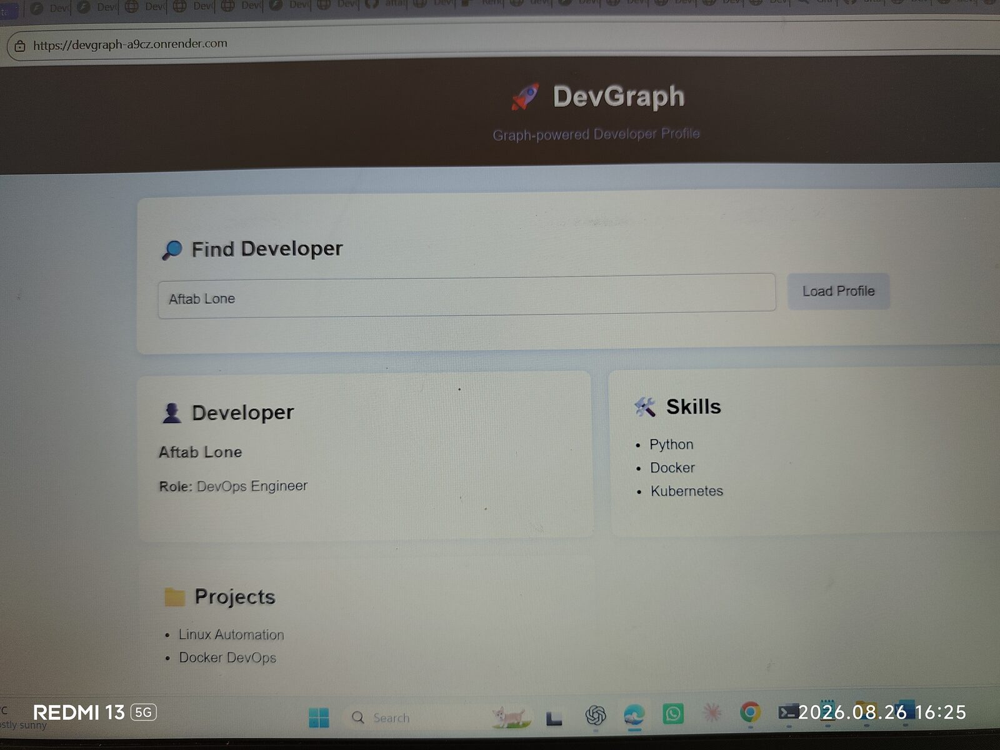
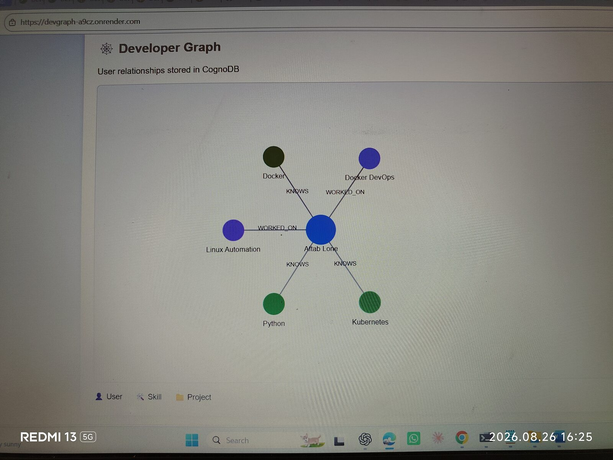
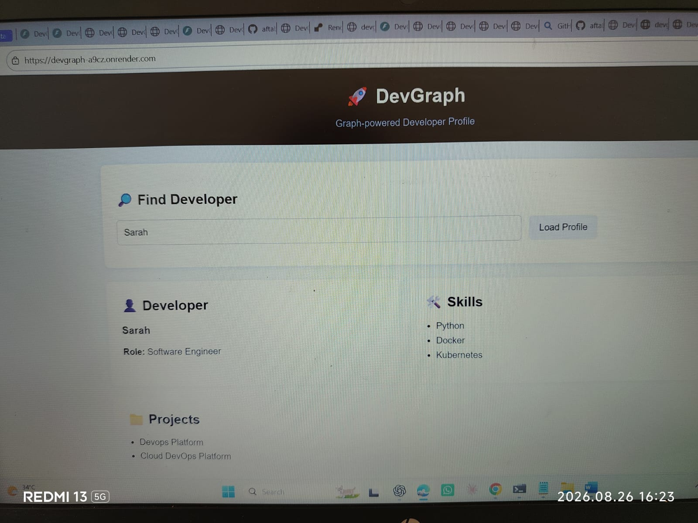
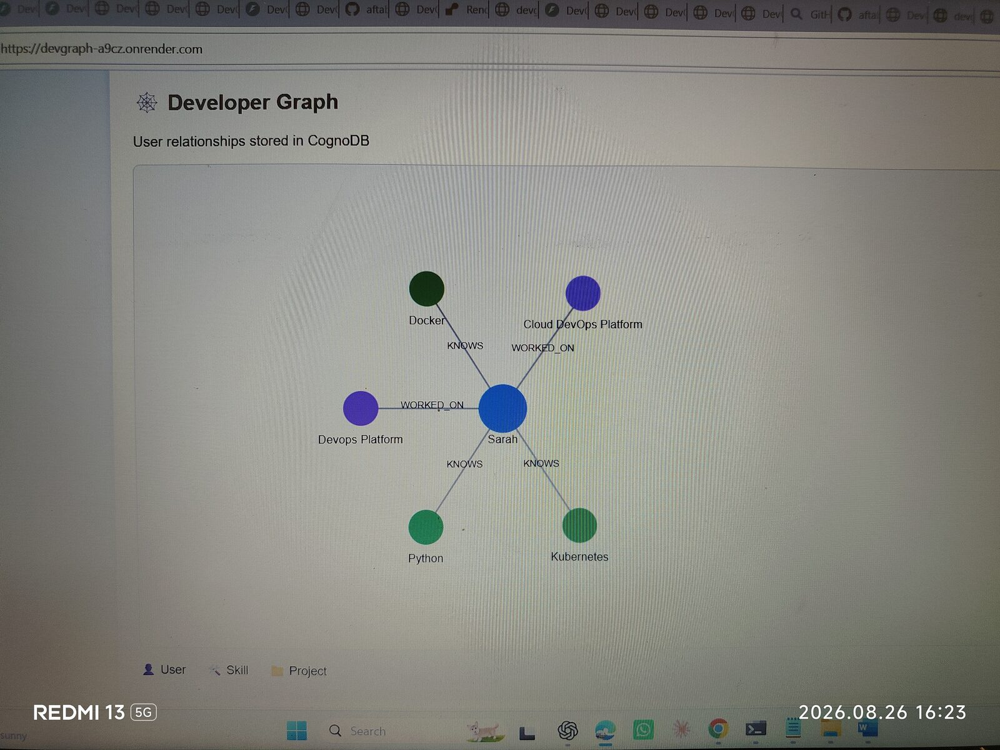
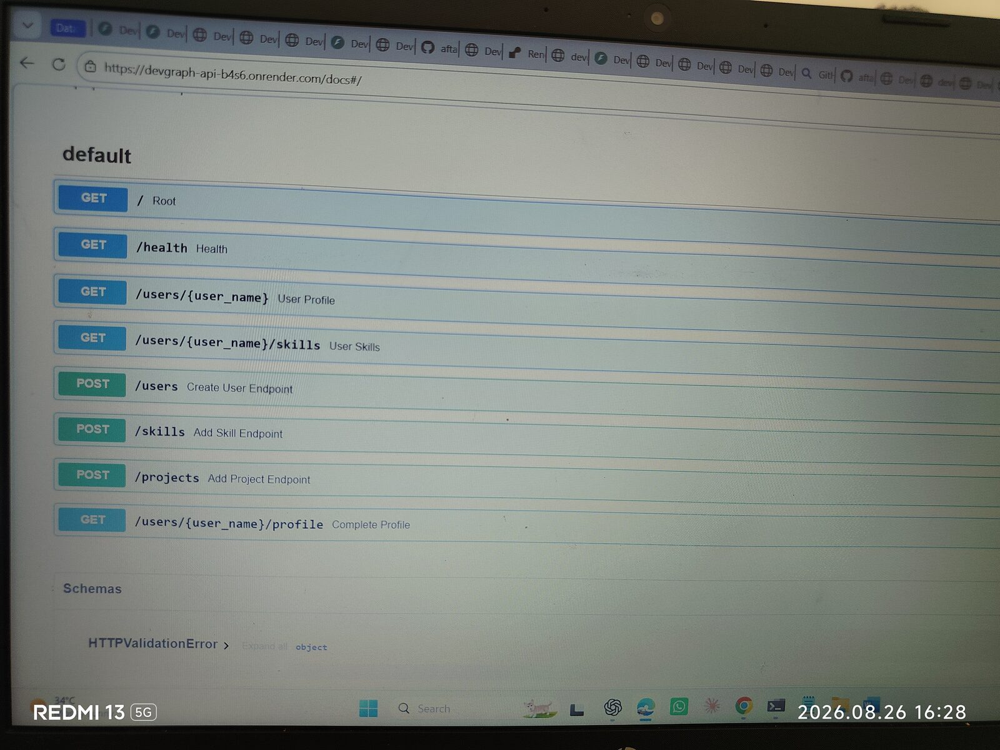
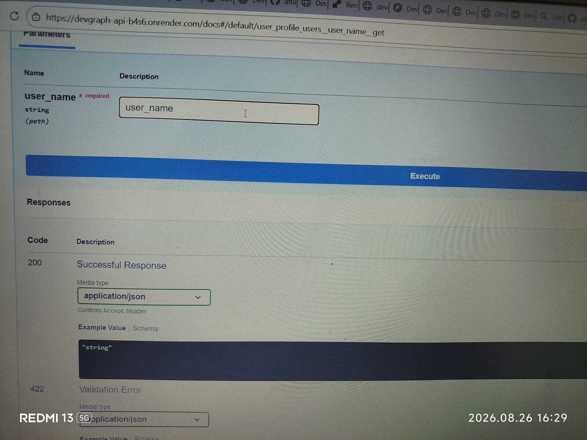
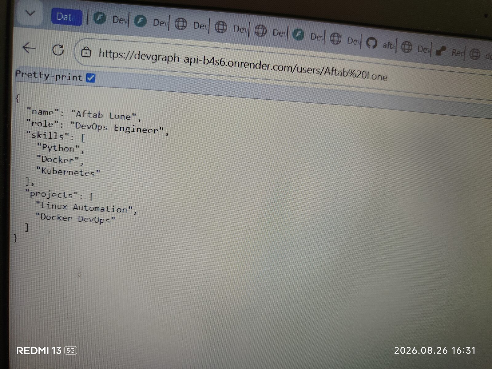

# 🚀 DevGraph

DevGraph is a graph-powered developer profile application built with **Python, FastAPI, and CognoDB**.

It models developers, skills, and projects as connected graph data and exposes the relationships through a REST API and a web frontend.

The application demonstrates how a graph database can answer relationship-oriented questions such as:

* What skills does a developer have?
* What projects has a developer worked on?
* Which projects are related to the skills of a developer?
* Which developers share skills with another developer?

---

## 📌 Features

* Developer profile management
* Skills stored as graph relationships
* Projects stored as graph relationships
* Project skill requirements
* Multi-hop graph traversal
* Shared-skill developer discovery
* FastAPI REST API
* CognoDB graph database
* Parameterized Cypher queries
* Official Neo4j Python driver
* Interactive Swagger API documentation
* Web frontend
* Developer profile visualization
* Environment-based database configuration
* Git-safe secret management
* Database health check
* Idempotent database seed script

---

## 💡 Why a Graph Database?

Developer skills and projects are naturally connected.

A relational database could store developers, skills, projects, and junction tables, but relationship-heavy questions would require multiple joins across those tables.

DevGraph uses CognoDB because the important information is about **connections between entities**.

For example:

```text
Developer
    |
    | KNOWS
    v
  Skill
    ^
    | REQUIRES
    |
  Project
```

This allows DevGraph to perform graph traversals such as:

> Find projects associated with skills known by a developer.

It can also find:

> Find other developers who share skills with a selected developer.

These relationship-oriented queries are natural graph traversals and become increasingly useful as the number of developers, skills, projects, and relationships grows.

---

## 🏗️ Architecture

```text
                    ┌──────────────────────┐
                    │       Browser        │
                    │   Web Frontend       │
                    └──────────┬───────────┘
                               │
                               │ HTTP / REST
                               ▼
                    ┌──────────────────────┐
                    │       FastAPI        │
                    │      REST API        │
                    └──────────┬───────────┘
                               │
                               ▼
                    ┌──────────────────────┐
                    │    Python Models     │
                    │   Parameterized      │
                    │    Cypher Queries    │
                    └──────────┬───────────┘
                               │
                               │ Bolt
                               ▼
                    ┌──────────────────────┐
                    │       CognoDB        │
                    │    Graph Database    │
                    └──────────────────────┘
```

---

## 🧩 Graph Data Model

DevGraph uses three primary node types:

```text
(:User)
(:Skill)
(:Project)
```

### Relationships

```text
(:User)-[:KNOWS]->(:Skill)

(:User)-[:WORKED_ON]->(:Project)

(:Project)-[:REQUIRES]->(:Skill)
```

### Data Model Diagram

```text
                    ┌──────────────┐
                    │    Skill     │
                    │   :Skill     │
                    └──────▲───────┘
                           │
                       KNOWS│
                           │
                    ┌──────┴───────┐
                    │     User     │
                    │    :User     │
                    └──────┬───────┘
                           │
                     WORKED_ON
                           │
                           ▼
                    ┌──────────────┐
                    │   Project    │
                    │  :Project    │
                    └──────┬───────┘
                           │
                        REQUIRES
                           │
                           ▼
                    ┌──────────────┐
                    │    Skill     │
                    │   :Skill     │
                    └──────────────┘
```

### Example Graph

```text
(Aftab Lone:User)
       │
       ├── KNOWS ──> (Python:Skill)
       ├── KNOWS ──> (Docker:Skill)
       └── KNOWS ──> (Kubernetes:Skill)
       │
       ├── WORKED_ON ──> (Linux Automation:Project)
       │                       │
       │                       ├── REQUIRES ──> (Python)
       │                       └── REQUIRES ──> (Linux)
       │
       └── WORKED_ON ──> (Docker DevOps:Project)
                               │
                               ├── REQUIRES ──> (Docker)
                               └── REQUIRES ──> (Python)
```

---

## 🛠️ Tech Stack

### Backend

* Python
* FastAPI
* Uvicorn
* Pydantic
* python-dotenv
* Neo4j Python Driver

### Database

* CognoDB
* openCypher
* Bolt protocol

### Frontend

* HTML
* CSS
* JavaScript
* D3.js

### Development

* Linux / Ubuntu WSL
* Git
* GitHub
* Python Virtual Environment

### Deployment

* Render
* CognoDB Cloud

---

## 📁 Project Structure

```text
devgraph/
│
├── backend/
│   ├── app.py
│   ├── db.py
│   ├── models.py
│   ├── test_cognodb.py
│   ├── test_db.py
│   ├── test_models.py
│   └── test_profile.py
│
├── frontend/
│   └── index.html
│
├── scripts/
│   └── seed.py
│
├── .gitignore
├── README.md
└── requirements.txt
```

Sensitive files such as `backend/.env`, Python virtual environments, compiled Python files, and cache directories are excluded from Git.

---

## 🔐 Environment Variables

Create:

```text
backend/.env
```

Add your CognoDB credentials:

```env
COGNODB_URI=bolt+s://your-instance.databases.cognodb.cloud
COGNODB_USERNAME=cognodb
COGNODB_PASSWORD=your-password
```

The credentials are loaded using environment variables and are never hard-coded into the application.

### Security

Never commit `.env` files to Git.

The repository `.gitignore` excludes:

```text
.env
*.env
.venv/
__pycache__/
*.pyc
```

---

# 🚀 Setup

## 1. Create a CognoDB Cloud Instance

Create a CognoDB Cloud account and create a free instance.

CognoDB provides a Bolt connection URI similar to:

```text
bolt+s://<instance-id>.databases.cognodb.cloud
```

The generated database password should be saved securely because it is provided when the instance is created.

Use the username:

```text
cognodb
```

---

## 2. Clone the Repository

```bash
git clone https://github.com/aftablone98/devgraph.git
cd devgraph
```

---

## 3. Create a Virtual Environment

```bash
python3 -m venv .venv
```

Activate it:

```bash
source .venv/bin/activate
```

---

## 4. Install Dependencies

```bash
pip install -r requirements.txt
```

---

## 5. Configure CognoDB

Create:

```text
backend/.env
```

Add:

```env
COGNODB_URI=bolt+s://your-instance.databases.cognodb.cloud
COGNODB_USERNAME=cognodb
COGNODB_PASSWORD=your-password
```

---

# 🌱 Seed the Database

Run:

```bash
python3 scripts/seed.py
```

The seed script creates sample:

* Developers
* Skills
* Projects
* `KNOWS` relationships
* `WORKED_ON` relationships
* `REQUIRES` relationships

The script is **idempotent**, using Cypher `MERGE` operations so it can safely be run multiple times without creating duplicate nodes or relationships.

Example:

```text
✅ Connected to CognoDB
🌱 Starting database seed...

✅ Seeded: Aftab Lone
✅ Seeded: Sarah

✅ Database seeding completed successfully!
```

---

# 🧪 Test CognoDB Connection

Run:

```bash
python3 backend/test_cognodb.py
```

The test verifies that the application can connect to CognoDB.

---

# 🧪 Test Database Models

Run:

```bash
python3 backend/test_models.py
```

The application should successfully retrieve developer skills and projects.

---

# ▶️ Start the Backend

From the project root:

```bash
uvicorn backend.app:app --reload --host 0.0.0.0 --port 8002
```

Local backend:

```text
http://localhost:8002
```

---

# 📚 API Documentation

FastAPI automatically provides interactive Swagger documentation.

Open:

```text
http://localhost:8002/docs
```

Production API documentation:

https://devgraph-api-b4s6.onrender.com/docs

---

# 🔌 API Endpoints

| Method | Endpoint                      | Description                    |
| ------ | ----------------------------- | ------------------------------ |
| GET    | `/`                           | API status                     |
| GET    | `/health`                     | CognoDB health check           |
| GET    | `/users/{user_name}`          | Get complete developer profile |
| GET    | `/users/{user_name}/skills`   | Get developer skills           |
| POST   | `/users`                      | Create developer               |
| POST   | `/users/{user_name}/skills`   | Add developer skill            |
| POST   | `/users/{user_name}/projects` | Add developer project          |

---

# 🔍 Main Cypher Queries

DevGraph uses the official Neo4j Python driver and parameterized Cypher queries.

User input is passed as parameters instead of being concatenated into Cypher strings.

For example:

```python
session.run(
    """
    MATCH (u:User {name: $user_name})
    RETURN u
    """,
    user_name=user_name
)
```

This keeps database queries safer and maintainable.

---

## 1. Developer Profile Query

The profile query connects a developer to both their skills and projects:

```cypher
MATCH (u:User {name: $user_name})

OPTIONAL MATCH (u)-[:KNOWS]->(s:Skill)

OPTIONAL MATCH (u)-[:WORKED_ON]->(p:Project)

RETURN
    u.name AS name,
    u.role AS role,
    collect(DISTINCT s.name) AS skills,
    collect(DISTINCT p.name) AS projects
```

This returns a developer's connected skills and projects in a single graph query.

---

## 2. Multi-Hop Graph Traversal

DevGraph demonstrates a 2-hop traversal:

```cypher
MATCH (u:User {name: $user_name})-[:KNOWS]->(s:Skill)
      <-[:REQUIRES]-(p:Project)

RETURN DISTINCT
    s.name AS skill,
    p.name AS project
ORDER BY skill, project
```

The traversal is:

```text
User
  │
  │ KNOWS
  ▼
Skill
  ▲
  │ REQUIRES
  │
Project
```

For example, querying:

```text
Aftab Lone
```

can discover projects connected through skills such as Python and Docker.

This demonstrates a graph traversal across multiple relationships rather than simply retrieving rows from one table.

---

## 3. Shared Skills Between Developers

DevGraph can also find developers who share skills:

```cypher
MATCH (u:User {name: $user_name})-[:KNOWS]->(s:Skill)
      <-[:KNOWS]-(other:User)

WHERE other.name <> $user_name

RETURN
    other.name AS developer,
    collect(DISTINCT s.name) AS shared_skills
ORDER BY developer
```

For example:

```text
Aftab Lone
     │
     │ KNOWS
     ▼
  Python
     ▲
     │ KNOWS
     │
   Sarah
```

The result identifies Sarah as another developer sharing:

```text
Python
Docker
Kubernetes
```

This is a relationship-oriented query that naturally maps to a graph model.

---

# 🧠 Why These Queries Benefit From Graph Modeling

The application's key questions are about relationships:

```text
Developer → Skills
Developer → Projects
Project → Required Skills
Developer → Shared Skills → Other Developers
```

As the graph grows, these relationships can be traversed directly without introducing additional join tables for every new relationship type.

For example:

```text
Developer
   ↓
Skill
   ↓
Project
```

can be extended with additional graph relationships such as:

```text
Developer → Company
Developer → Certification
Project → Technology
Skill → Category
Developer → Developer
```

This makes the model flexible for relationship-heavy developer discovery use cases.

---

# 👤 Example Developer

### Aftab Lone

**Role:** DevOps Engineer

**Skills:**

```text
Python
Docker
Kubernetes
```

**Projects:**

```text
Linux Automation
Docker DevOps
```

### Sarah

**Role:** Software Engineer

**Skills:**

```text
Python
Docker
Kubernetes
```

**Projects:**

```text
Cloud DevOps Platform
```

---

# 🖥️ Frontend

The frontend is a lightweight web application that allows a non-technical user to select a developer and load their profile.

It displays:

* Developer name
* Role
* Skills
* Projects
* Graph relationships

### Run Locally

From the frontend directory:

```bash
cd frontend
python3 -m http.server 3000
```

Open:

```text
http://localhost:3000
```

The frontend communicates with the FastAPI backend.

```text
Browser
   │
   ▼
Frontend :3000
   │
   │ REST API
   ▼
FastAPI :8002
   │
   ▼
CognoDB
```

---

# 🌐 Production Deployment

DevGraph is deployed using Render.

### Frontend

https://devgraph-a9cz.onrender.com

### Backend

https://devgraph-api-b4s6.onrender.com

### API Documentation

https://devgraph-api-b4s6.onrender.com/docs

The production frontend communicates with the hosted FastAPI backend, which connects to the live CognoDB instance.

---

# 🩺 Health Check

The backend provides a health endpoint:

```bash
curl http://localhost:8002/health
```

Expected response:

```json
{
  "status": "healthy",
  "database": "CognoDB"
}
```

Production:

```text
https://devgraph-api-b4s6.onrender.com/health
```

The health check verifies database connectivity and allows deployment infrastructure to determine whether the service is healthy.

---

# 🔎 Example API Request

Get a developer profile:

```bash
curl "http://localhost:8002/users/Aftab%20Lone"
```

Example response:

```json
{
  "name": "Aftab Lone",
  "role": "DevOps Engineer",
  "skills": [
    "Python",
    "Docker",
    "Kubernetes"
  ],
  "projects": [
    "Linux Automation",
    "Docker DevOps"
  ]
}
```

---

# ⚠️ Error Handling

The application handles database connectivity problems through the health endpoint and API error responses.

If a requested developer does not exist, the API returns an appropriate error response instead of silently returning invalid data.

Database credentials are loaded from environment variables so they are not embedded in application source code.

---

# 📸 UI Screenshots

The following screenshots demonstrate the DevGraph application, developer profiles, graph visualization, API documentation, and API responses.

### 👤 Aftab Lone Profile



### 📊 Aftab Lone Graph



### 👤 Sarah Profile



### 📊 Sarah Graph



### 🔌 API Methods

The API documentation shows the available `GET` and `POST` endpoints.



### 🧪 Swagger API — Try It Out

The Swagger UI `Try it out` functionality was used to test the API by entering a developer name.



### 🚀 DevGraph API Response

Example API response for the Aftab Lone developer endpoint.



---

# 🎥 Demo Video

**[▶️ Watch the DevGraph Demo](https://www.youtube.com/watch?v=prVAzjz1apg)**

A short screen recording demonstrates the complete application flow:

```text
nano README.mdOpen DevGraph
     ↓
Select developer
     ↓
Load profile
     ↓
View skills
     ↓
View projects
     ↓
Show Swagger API
     ↓
Show deployed application
```

The screen recording is included with the final assignment submission.

---

# 🔒 Security

Sensitive configuration is stored outside Git.

Ignored files include:

```text
.env
*.env
.venv/
__pycache__/
*.pyc
```

Database passwords should never be committed to the repository.

The production application reads CognoDB credentials from environment variables configured in the deployment environment.

---

# 🧪 Verification

The following have been tested successfully:

* CognoDB connection
* Database seed
* Idempotent seed execution
* Developer profile retrieval
* Developer skill retrieval
* Developer/project relationships
* Multi-hop graph traversal
* Shared-skill developer traversal
* FastAPI health endpoint
* FastAPI Swagger documentation
* Frontend/backend communication
* Production backend
* Production frontend

---

# 🚀 Future Improvements

Potential extensions include:

* Developer search
* Authentication and authorization
* More graph relationship types
* Advanced graph visualization
* More comprehensive automated tests
* CI/CD pipeline
* Docker deployment
* Monitoring and observability
* Additional developer recommendation queries

---

# 👨‍💻 Author

**Aftab Lone**

GitHub:

https://github.com/aftablone98

---

# 📄 License

This project is created for learning, portfolio, and technical demonstration purposes.
